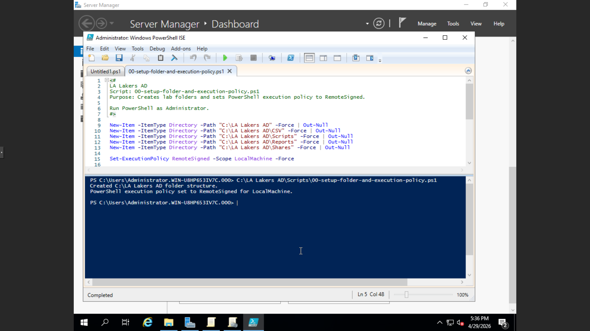
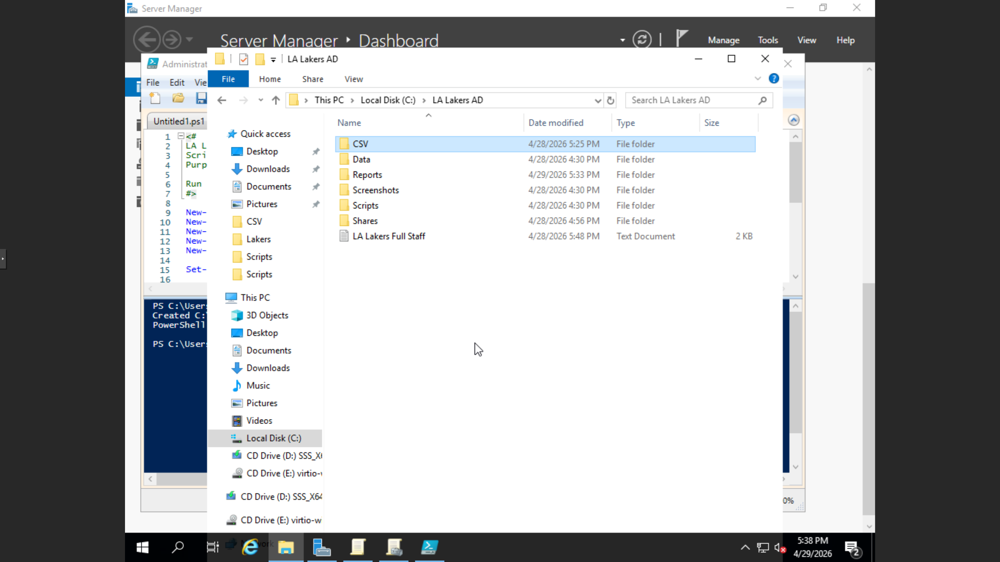

# Phase 01: Initial AD Structure & Environment Prep

This phase establishes the foundation of the `lakers.local` lab environment. Before complex automation can occur, the system environment must be configured to allow script execution and directory services initialization.

### 📜 Featured Script
* **`00-setup-folder-and-execution-policy.ps1`**: This script automates the initial environment prep by setting the PowerShell Execution Policy to `RemoteSigned` and verifying the necessary directory paths for the lab.

### ⚙️ Implementation Details
* **Execution Policy:** Configured to allow locally created scripts to run while requiring digital signatures for scripts downloaded from the internet.
* **Scope:** Applied at the LocalMachine level to ensure all administrative tasks in this lab proceed without "Script Block" interruptions.

### 🛠️ Troubleshooting & Lessons Learned
* **Issue:** Script execution was blocked by default Windows security settings.
* **Solution:** Used `Set-ExecutionPolicy` to bypass the restriction for the administrative session.
* **Lesson:** Always verify the execution policy as the very first step in a new Windows Server build to avoid "Access Denied" errors in later automation phases.

---
### ✅ Lab Validation

### ✅ Lab Validation
