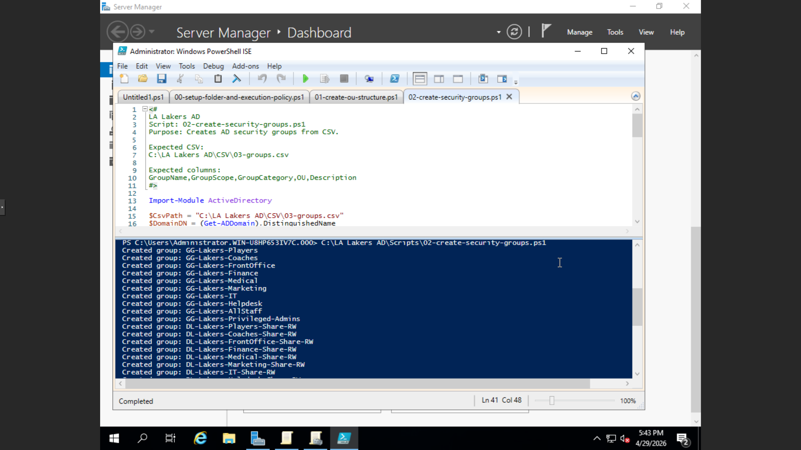
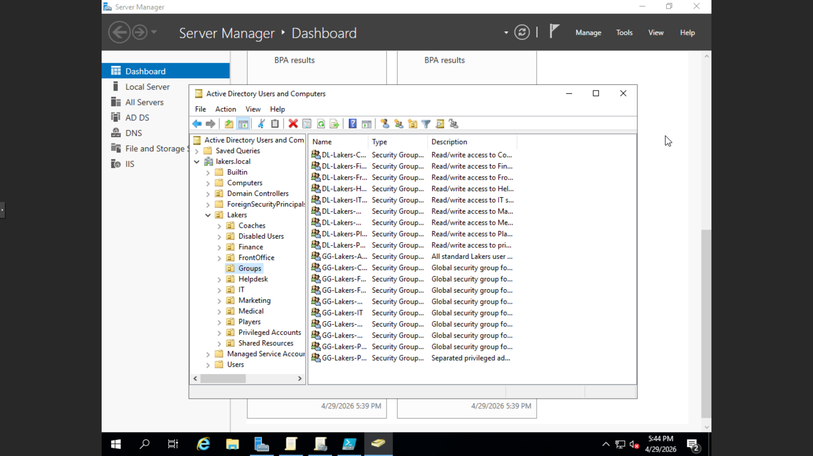

Phase 02: Automated Security Group Deployment
This component of the lab focuses on the automated creation of Active Directory Security Groups. By utilizing a data-driven approach with PowerShell, I ensure that the infrastructure supports a consistent and secure access model across the lakers.local domain.

📜 Featured Script
02-create-security-groups.ps1: A robust orchestration script that parses a CSV file to create and organize AD groups programmatically.

⚙️ Technical Logic
Module Integration: Utilizes the ActiveDirectory module to interact directly with the domain controller.

Error Handling: Includes logic to verify the CSV file path and check for existing groups to prevent duplicate object errors.

Dynamic OU Mapping: The script automatically locates the correct Organizational Unit (OU) for each group based on the CSV data, ensuring correct placement within the lakers.local hierarchy.

Flexible Group Scoping: Supports varied Group Scopes (Global, Universal) and Categories (Security, Distribution) while defaulting to industry-standard "Global Security" settings.

🏗️ Infrastructure Standards
Standardized Descriptions: Every group is created with a clear description to ensure administrative transparency and easier auditing.

Automation Efficiency: Transitioning from manual GUI creation to a CSV-driven model allows for the instant deployment of dozens of groups across multiple departments (IT, HR, Sales, etc.).

🛠️ Troubleshooting & Lessons Learned
Challenge: Group creation would fail if the parent OU had not been initialized first.

Solution: Integrated a validation step using Get-ADOrganizationalUnit to ensure the target OU exists before attempting to create the group object.

Lesson: Data-driven automation requires "sanitized" inputs; the script utilizes .Trim() to remove accidental whitespace from CSV data that could cause naming failures in AD.

### ✅ Lab Validation

### ✅ Lab Validation
