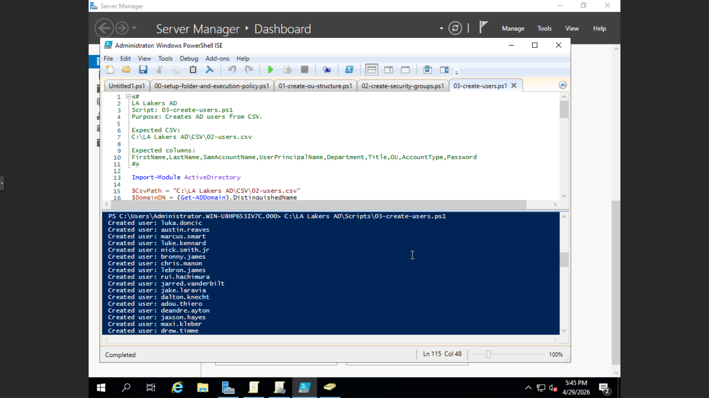
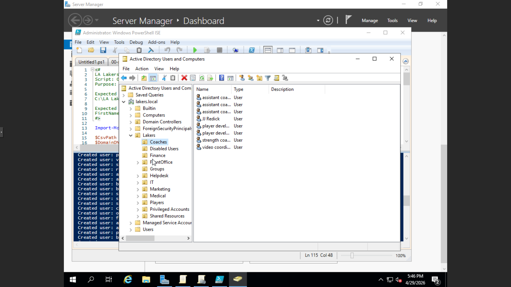
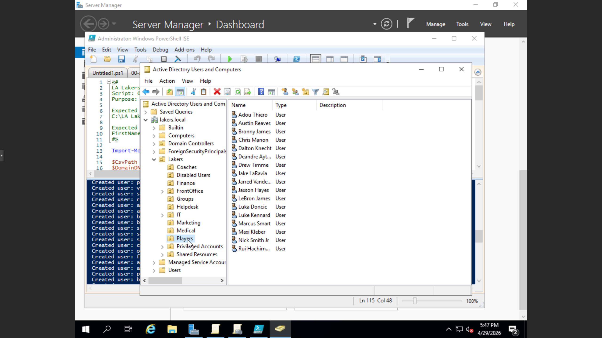
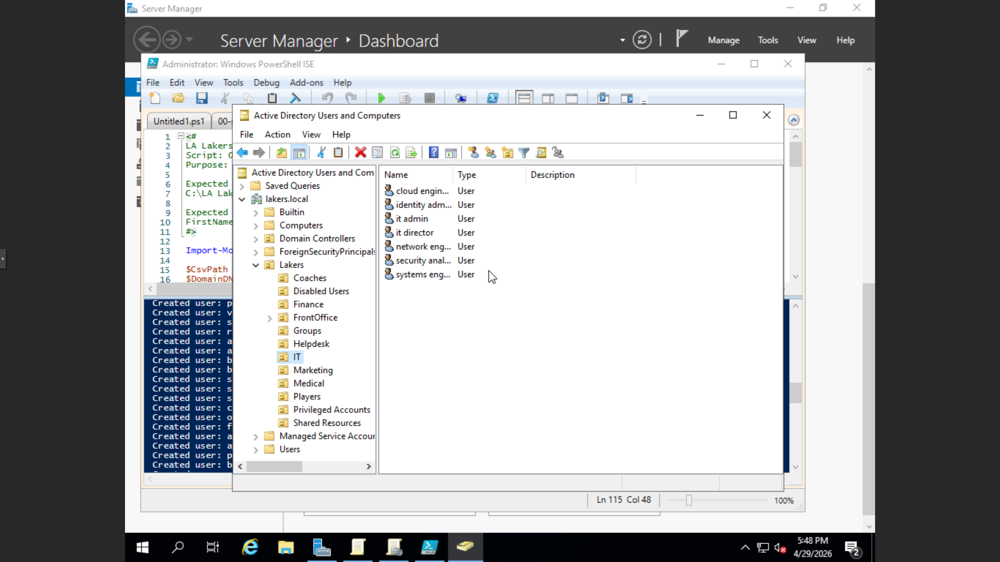

# Phase 03: Automated Bulk User Provisioning

This phase demonstrates the automation of the identity lifecycle. Instead of manually creating accounts, I utilized a PowerShell-driven approach to ingest identity data from a CSV source and programmatically generate Active Directory objects.

### 📜 Featured Assets
* **`03-create-users-from-csv.ps1`**: The orchestration script that parses the CSV and creates AD users.
* **`users.csv`**: The source-of-truth data file containing names, departments, and job titles.

### ⚙️ Automation Logic
1. **Data Ingestion:** The script imports the CSV and iterates through each row.
2. **Variable Mapping:** Attributes (First Name, Last Name, Dept) are mapped to AD parameters.
3. **Password Security:** Initial passwords are set to a standard complex temporary value with the "User must change password at next logon" flag enabled.
4. **Targeting:** Users are automatically placed into the departmental OUs created in Phase 02.

### 🛡️ IAM Best Practices
* **Standardization:** Prevents human error in naming conventions (e.g., ensuring all usernames are `first.last`).
* **Efficiency:** Reduces provisioning time from hours to seconds.
* **Auditability:** The script can be updated to log success/failure for each account created.

### 🛠️ Troubleshooting
* **Challenge:** Handling duplicate usernames or special characters in names.
* **Solution:** Integrated a check within the script to verify if a SamAccountName already exists before attempting creation.

### ✅ Lab Validation

### ✅ Lab Validation

### ✅ Lab Validation

### ✅ Lab Validation
