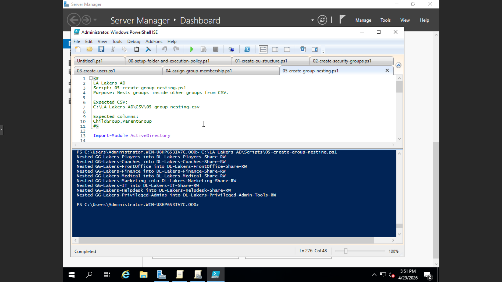
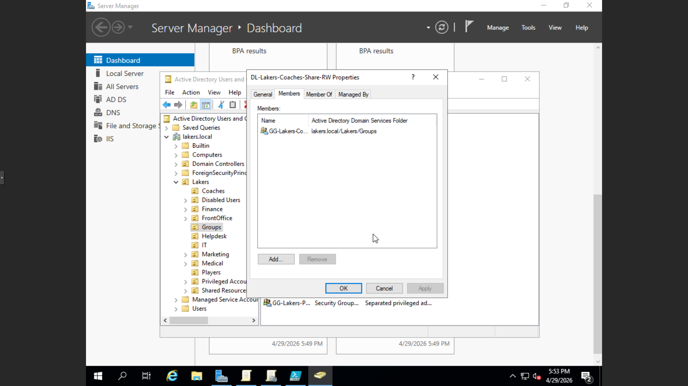
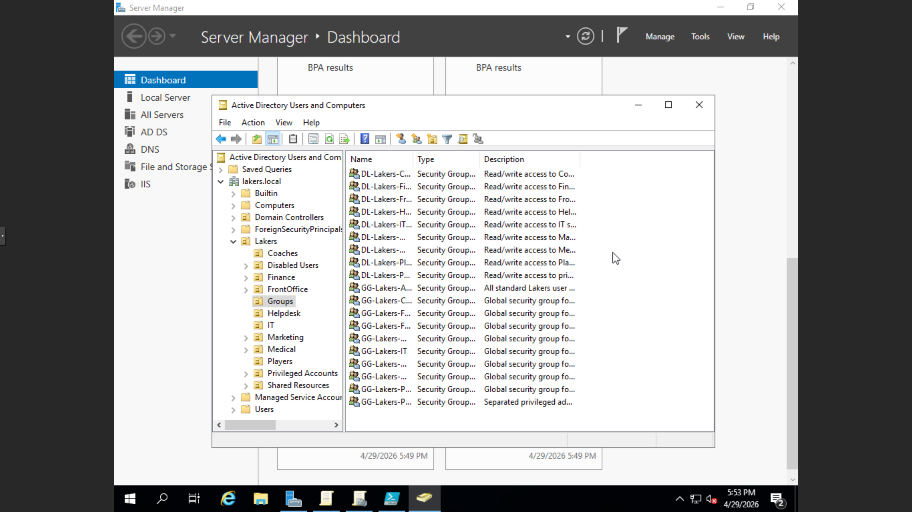

# Phase 05: Automated Group Nesting & Infrastructure Optimization
This phase focuses on establishing a sophisticated group hierarchy within the lakers.local domain. By implementing automated Group Nesting, I have created a structured environment that simplifies administrative overhead and ensures consistent permission inheritance across the organization.

📜 Featured Script
05-create-group-nesting.ps1: A PowerShell orchestration script that programmatically nests "Child" groups into "Parent" groups based on a defined CSV architecture.

⚙️ Technical Logic
CSV-Driven Mapping: The script ingests data from 05-group-nesting.csv to map relationships between Child and Parent group objects.

Pre-Execution Validation: Dual-verification checks are performed using Get-ADGroup to confirm both the Child and Parent groups exist in the domain before attempting any modifications.

Resilient Error Handling: Utilizes a try/catch block to manage exceptions. It specifically identifies if a nesting relationship already exists, allowing the script to continue without interruption while providing clear console feedback.

Identity Module Integration: Leverages the ActiveDirectory module for direct interaction with domain objects.

🏗️ IAM Architecture Benefits
Permission Inheritance: By nesting departmental groups into broader resource groups, permissions can be managed at a higher level, reducing the need for individual user assignments.

Scalability: This model allows for rapid organizational changes; updating a single parent group can immediately affect the access levels of all nested child groups.

Standardized Operations: Replaces manual, error-prone GUI nesting with a repeatable, scriptable process that serves as a living record of the domain's group structure.

🛠️ Troubleshooting & Lessons Learned
Challenge: Standard PowerShell commands for group modification can be "noisy" and fail if a relationship is already present.

Solution: Implemented custom logic to filter for "already a member" exceptions, turning potential errors into helpful status updates.

Lesson: Data sanitization remains critical. The script uses .Trim() on all CSV inputs to eliminate "Object Not Found" errors caused by hidden whitespaces in the source data.

### ✅ Lab Validation

### ✅ Lab Validation

### ✅ Lab Validation

