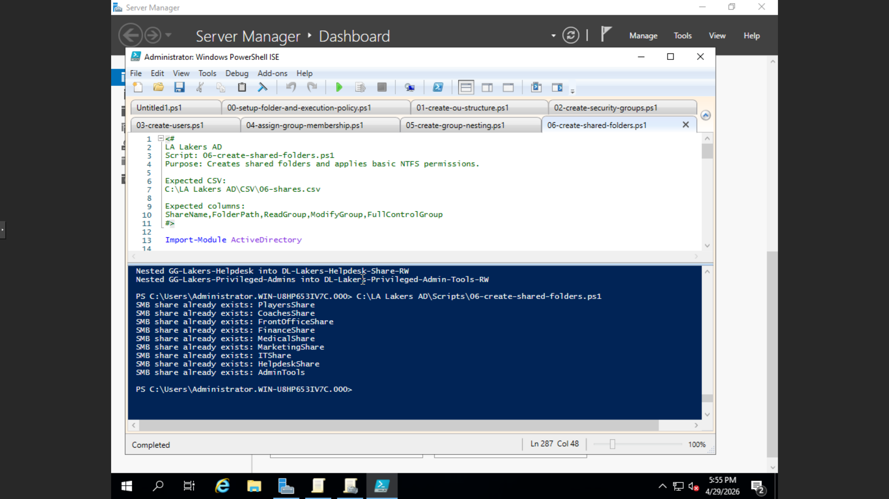

Phase 06: Automated File Services & NTFS Security Orchestration
This phase demonstrates the automation of enterprise resource provisioning within the lakers.local domain. By utilizing PowerShell to deploy SMB shares and programmatically enforce NTFS permissions, I have established a secure, "Least Privilege" file-sharing infrastructure.

📜 Featured Script
06-create-shared-folders.ps1: A comprehensive script that automates the creation of directory structures, manages SMB shares, and applies granular Access Control Lists (ACLs).

⚙️ Technical Logic
Idempotent Directory Creation: The script checks for the existence of local folder paths before creation to prevent system errors.

ACL Inheritance Management: Programmatically disables inherited permissions and wipes existing Access Control entries to ensure a "Clean Slate" security model.

Role-Based Access Mapping: Maps specific Active Directory groups (Read, Modify, Full Control) to their corresponding NTFS permissions using FileSystemAccessRule objects.

SMB Provisioning: Automates the creation of network shares using New-SmbShare, granting initial change access to "Authenticated Users" while restricting fine-grained access at the NTFS level.

🛡️ IAM & Data Security Standards
Zero Trust Foundation: By stripping inherited rules and explicitly adding only necessary groups (Domain Admins, SYSTEM, and designated departmental groups), the environment adheres to the Principle of Least Privilege.

Infrastructure as Code (IaC): Moving share management into a CSV-driven script allows for rapid disaster recovery and audit-ready documentation of the file server's state.

System Integrity: Critical system identities like "Domain Admins" and "SYSTEM" are hard-coded into the security rules to ensure administrative access is never accidentally severed during automation.

🛠️ Troubleshooting & Lessons Learned
Challenge: Manual NTFS permissioning is highly susceptible to "Permission Creep" and accidental inheritance from root drives.

Solution: Utilized the .SetAccessRuleProtection($true, $false) method to programmatically "seal" folders from parent inheritance.

Lesson: In a complex IAM environment, always use ContainerInherit, ObjectInherit flags. This ensures that security rules applied to a folder correctly flow down to all future files and sub-folders created inside it.

### ✅ Lab Validation
