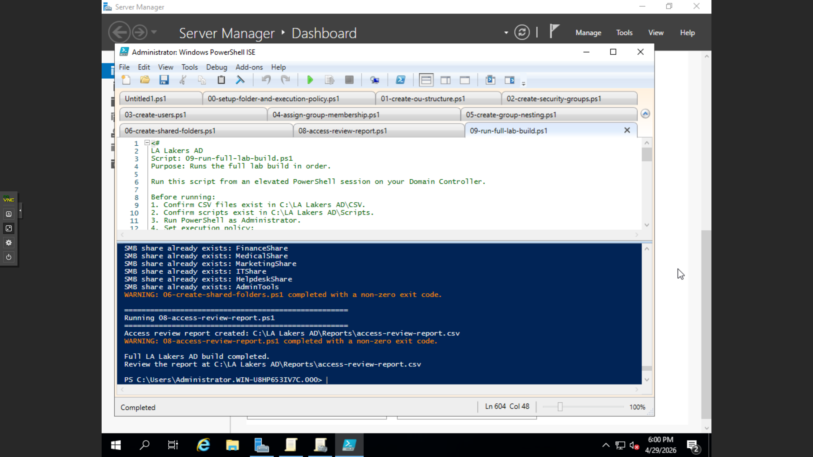

Phase 09: Automated Master Lab Orchestration
This final component serves as the automation engine for the entire lakers.local environment. By developing a master orchestration script, I have unified the various phases of the identity lifecycle into a single, repeatable deployment workflow. This demonstrates high-level proficiency in DevOps practices applied to Windows Systems Administration.

📜 Featured Script
09-run-full-lab-build.ps1: A master controller that executes the full lab build in the correct logical order, from OU structure creation to final auditing.

⚙️ Technical Logic
Sequential Execution: The script utilizes a predefined array to ensure that dependencies are respected—for example, ensuring OUs exist before users are created, and users exist before group memberships are assigned.

Dynamic Path Resolution: Uses Join-Path to programmatically locate sub-scripts within the C:\LA Lakers AD\Scripts directory, ensuring the build is portable and path-aware.

Status Monitoring: Includes real-time console feedback with visual separators to track the progress of each phase as it executes.

Exit Code Validation: Monitors $LASTEXITCODE for every script run, providing warnings if a specific module fails so that administrators can troubleshoot without losing track of the build state.

🚀 Operational Benefits
Disaster Recovery: Allows for the complete recreation of the domain's logical structure from scratch in minutes rather than hours.

Environment Parity: Ensures that a "Dev" lab environment is exactly identical to a "Test" or "Production" environment by using the same source scripts and CSV data.

Reduced Human Error: Eliminates the risk of running steps out of order or skipping critical security configurations.

🛠️ Prerequisites & Setup
To successfully execute the master build, the following environment state is required:

Elevated Privileges: Must be run from an Administrator PowerShell session on a Domain Controller.

Execution Policy: Set to RemoteSigned to allow the execution of local orchestration scripts.

Data Integrity: All source CSV files must be present in C:\LA Lakers AD\CSV and all technical modules present in C:\LA Lakers AD\Scripts.

### ✅ Lab Validation
